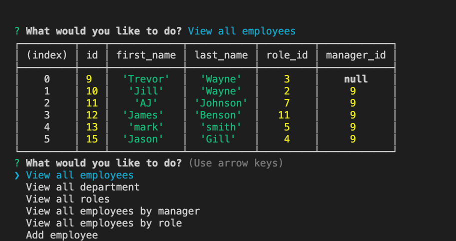
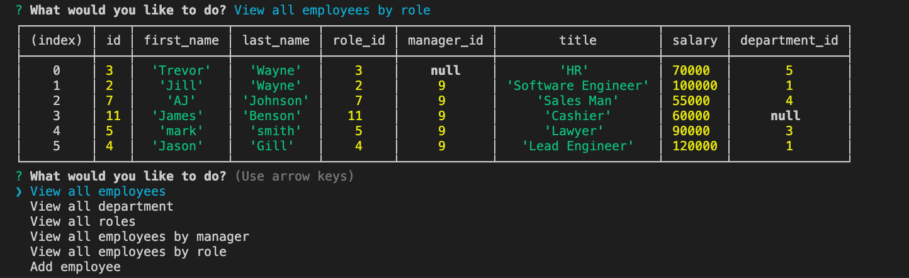

# Employee Tracker
# Description
This Project is made for user who wants to view and manage the employees inside the company by looking in each department,roles and managers using a command-line application to organize and plan the business. 

In this application, user have the option to add,view and update employee, roles and department. 

MYSQL, Inquirer, console.table is used in the process in creating this application.

The photos below shows the running program:

Click [here](https://drive.google.com/file/d/1S5aL_bOONri2oe9T7qPXqgdenpoYeUyo/view) to access the video of the running program.

In future development, I would like to be able to add an update option in the application and try to add a view employees by department.

# Table Of Contents
  * [Description](#description)
  * [Installation](#installation)
  * [Usage](#usage)
  * [License](#license)
  * [Contributing](#contributing)
  * [Tests](#tests)
  * [Questions](#questions)
# Installation
npm install 
# Usage
npm start
# Licence 
MIT
# Contributors
gracee19
# Test 

# Questions 
 
For more information you can check my Github account gracee19(https://github.com/gracee19). 
